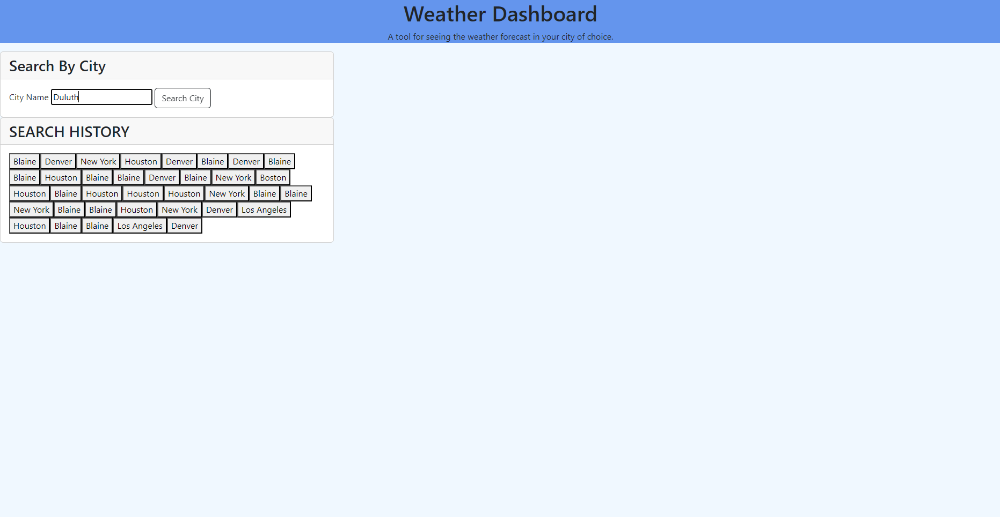
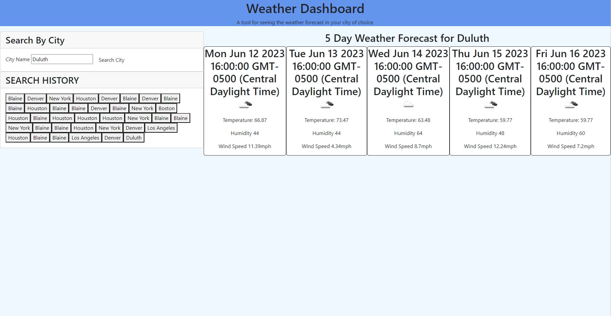

# <Weather Dashboard>

## Description

I created this weather dashboard to gain a better understanding of using server side API's. Specifically, I now better understand how to use the fetch method in JavaScript. This weather dashboard will display a 5 day weather forecast for any city that is entered by the user. I used a weather API to accomplish this.

## Installation

To install this project, just pull the code down from the repository.

## Usage

This is an easy application to use. Just type the city's weather forecast that you would like to see into the search bar, then click the search button. The 5 day weather forecast will then be displayed.

## Credits

My tutors Mila Hose and Andres Long were very helpful. They helped me to better understand the fetch method, and also guided me in the right direction to building a functioning history tab.

## License

The last section of a high-quality README file is the license. This lets other developers know what they can and cannot do with your project. If you need help choosing a license, refer to [https://choosealicense.com/](https://choosealicense.com/).
